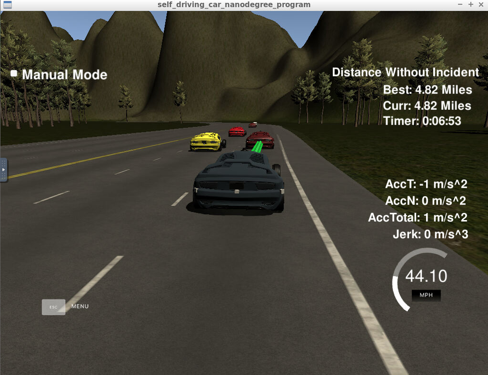
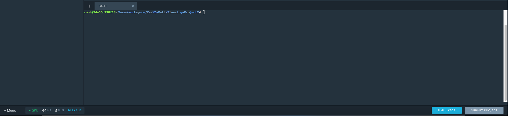
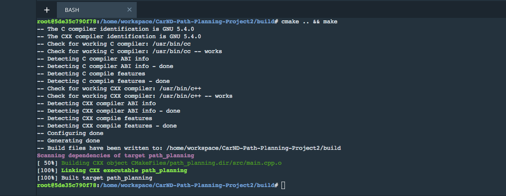
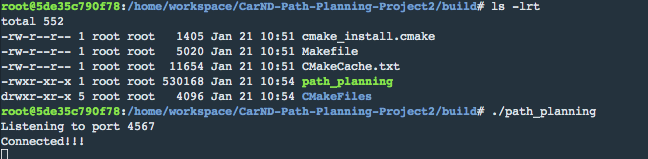

# CarND-Path-Planning-Project
Self-Driving Car Engineer Nanodegree Program
   
   

### Goals
In this project your goal is to safely navigate around a virtual highway with other traffic that is driving +-10 MPH of the 50 MPH speed limit. You will be provided the car's localization and sensor fusion data, there is also a sparse map list of waypoints around the highway. The car should try to go as close as possible to the 50 MPH speed limit, which means passing slower traffic when possible, note that other cars will try to change lanes too. The car should avoid hitting other cars at all cost as well as driving inside of the marked road lanes at all times, unless going from one lane to another. The car should be able to make one complete loop around the 6946m highway. Since the car is trying to go 50 MPH, it should take a little over 5 minutes to complete 1 loop. Also the car should not experience total acceleration over 10 m/s^2 and jerk that is greater than 10 m/s^3.

#### The map of the highway is in data/highway_map.txt
Each waypoint in the list contains  [x,y,s,dx,dy] values. x and y are the waypoint's map coordinate position, the s value is the distance along the road to get to that waypoint in meters, the dx and dy values define the unit normal vector pointing outward of the highway loop.

The highway's waypoints loop around so the frenet s value, distance along the road, goes from 0 to 6945.554.

## Basic Build Instructions

1. Clone this repo. 
2. Make a build directory: `mkdir build && cd build`
3. Compile: `cmake .. && make`

4. Run it: `./path_planning`. (Once you are in GPU Mode!!!)

## Tips

A really helpful resource for doing this project and creating smooth trajectories was using http://kluge.in-chemnitz.de/opensource/spline/, the spline function is in a single hearder file is really easy to use.

## Code Style

Please (do your best to) stick to [Google's C++ style guide](https://google.github.io/styleguide/cppguide.html).

## Project Instructions and Rubric

### Project can be build without errors

### Car drives

### No JERK

### No collission with other cars or street boundaries

### changing lane (yes, but sometimes it does change without reason - maybe obstacle out of visual screen)
 

